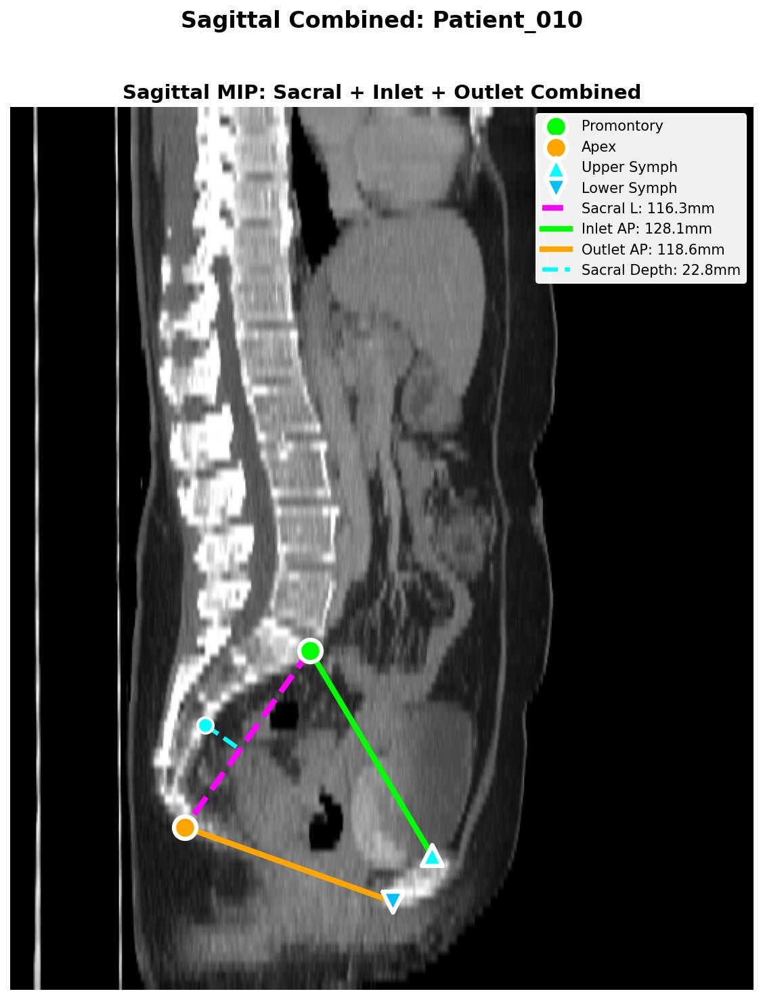

# ctpelvimetry

[](https://pypi.org/project/ctpelvimetry/)
[](https://pypi.org/project/ctpelvimetry/)
[](https://github.com/odafeng/ctpelvimetry/blob/main/LICENSE)

**The first open-source Python package for fully automated CT pelvimetry and body composition analysis.**

Automatically measure pelvic dimensions and body composition from CT images — no manual annotation required. Integrates with [TotalSegmentator](https://github.com/wasserth/TotalSegmentator) for segmentation and provides a complete DICOM-to-results pipeline.

```bash
pip install ctpelvimetry
```

## Why ctpelvimetry?

- **Fully automated** — from DICOM to structured results in one command, no manual landmark placement
- **Reproducible** — eliminates inter-observer variability inherent in manual CT pelvimetry
- **Batch-ready** — process hundreds of patients with progress tracking and failure summaries
- **Quality-controlled** — automatic detection of pelvic rotation, tilt, and sacrum offset with QC figures
- **Modular** — use the full pipeline or individual analysis functions via CLI or Python API

## Features

### Pelvimetry Measurements

| Metric | Description |
|---|---|
| ISD (mm) | Inter-Spinous Distance |
| APD (mm) | Antero-Posterior Diameter at ISD level |
| Inlet AP (mm) | Promontory → Upper Symphysis |
| Outlet AP (mm) | Apex → Lower Symphysis |
| Outlet Transverse (mm) | Intertuberous diameter |
| Outlet Area (cm²) | Ellipse approx: π/4 × AP × Transverse |
| Sacral Length (mm) | Promontory → Apex |
| Sacral Depth (mm) | Max anterior concavity |

### Body Composition Measurements

| Metric | Description |
|---|---|
| VAT (cm²) | Visceral Adipose Tissue area |
| SAT (cm²) | Subcutaneous Adipose Tissue area |
| V/S ratio | VAT / SAT ratio |
| SMA (cm²) | Skeletal Muscle Area |

Measured at L3 vertebral level and ISD (mid-pelvis) level.

### Key Features

- **Per-metric error isolation** — failure in one metric does not affect the others
- **Quality gates** — automatic detection of pelvic rotation, tilt, and sacrum offset
- **Batch processing** — process hundreds of patients with progress tracking and failure summaries
- **QC figures** — sagittal combined, extended 3-panel, and body composition overlays
- **Modular design** — use the full pipeline or individual analysis functions

<!-- TODO: Add QC figure examples, e.g.:  -->

## Installation

```bash
# Basic install (analyse existing segmentations)
pip install ctpelvimetry

# Full install (includes TotalSegmentator for segmentation)
pip install "ctpelvimetry[seg]"
```

> **Note:** The full install pulls in TotalSegmentator and its PyTorch dependencies.
> If you only need to analyse pre-existing segmentations, the basic install is sufficient.

### Dependencies

| Package | Minimum Version |
|---|---|
| numpy | ≥ 1.24 |
| nibabel | ≥ 5.0 |
| pandas | ≥ 2.0 |
| scipy | ≥ 1.11 |
| matplotlib | ≥ 3.7 |
| tqdm | ≥ 4.60 |
| TotalSegmentator | ≥ 2.0 *(optional, `pip install ".[seg]"`)* |

## Usage Examples

### CLI — Pelvimetry (from existing segmentation)

```bash
ctpelvimetry pelv \
  --seg_folder /path/to/segmentations \
  --nifti_path /path/to/ct.nii.gz \
  --patient Patient_001 \
  --output_root ./output --qc
```

### CLI — Full Pipeline (DICOM → NIfTI → Seg → Measurements)

```bash
ctpelvimetry pelv \
  --dicom_dir /path/to/Patient_001 \
  --output_root ./output \
  --patient Patient_001
```

### CLI — Body Composition

```bash
ctpelvimetry body-comp \
  --patient Patient_001 \
  --seg_root ./batch_output \
  --nifti_root ./batch_output \
  --pelvimetry_csv ./batch_output/combined_pelvimetry_report.csv \
  --output body_comp.csv --qc
```

### CLI — Batch Processing

```bash
# Pelvimetry batch
ctpelvimetry pelv \
  --dicom_root /path/to/DICOMs \
  --output_root ./output \
  --start 1 --end 250

# Body composition batch
ctpelvimetry body-comp \
  --seg_root ./batch_output \
  --nifti_root ./batch_output \
  --pelvimetry_csv ./report.csv \
  --output body_comp.csv \
  --start 1 --end 210 --qc_root ./qc
```

### Python API

```python
from ctpelvimetry import run_combined_pelvimetry, process_single_patient

# Pelvimetry
result = run_combined_pelvimetry(
    "Patient_001", "/path/to/seg", "/path/to/ct.nii.gz"
)

# Body composition
result = process_single_patient(
    "Patient_001", "/path/to/seg_root",
    "/path/to/ct.nii.gz", "/path/to/report.csv"
)
```

## Package Structure

```
ctpelvimetry/
├── __init__.py          # Public API
├── config.py            # PelvicConfig, constants
├── io.py                # Mask loading, coordinate transforms
├── conversion.py        # DICOM → NIfTI (dcm2niix)
├── segmentation.py      # TotalSegmentator execution
├── landmarks.py         # Midline, symphysis, sacral landmarks
├── metrics.py           # ISD, APD, ITD, sacral depth
├── body_composition.py  # VAT/SAT/SMA analysis
├── qc.py                # QC figure generation
├── pipeline.py          # run_combined_pelvimetry, run_full_pipeline
├── batch.py             # Batch orchestration
└── cli.py               # Unified CLI entry point
```

## Contributing

Contributions are welcome! Please follow these steps:

1. Fork the repository
2. Create a feature branch (`git checkout -b feature/your-feature`)
3. Commit your changes (`git commit -m "Add your feature"`)
4. Push to the branch (`git push origin feature/your-feature`)
5. Open a Pull Request

## Citation

If you use **ctpelvimetry** in your research, please cite:

```bibtex
@software{huang2025ctpelvimetry,
  author    = {Huang, Shih-Feng},
  title     = {ctpelvimetry: Automated CT Pelvimetry and Body Composition Analysis},
  year      = {2025},
  url       = {https://github.com/odafeng/ctpelvimetry},
  version   = {1.1.0}
}
```

> *A peer-reviewed manuscript describing ctpelvimetry is currently in preparation. Citation details will be updated upon publication.*

## License

This project is licensed under the [Apache License 2.0](LICENSE).
